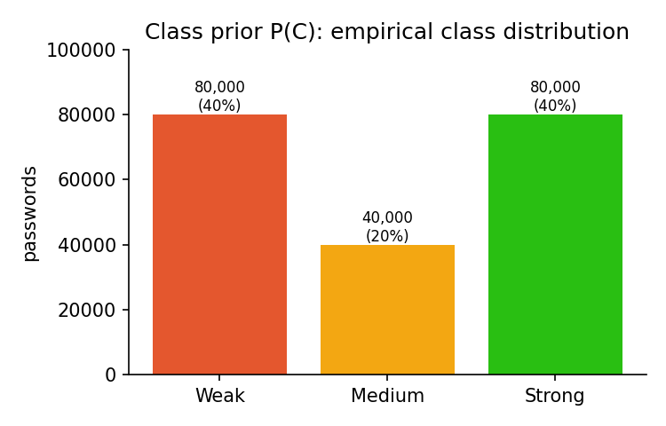
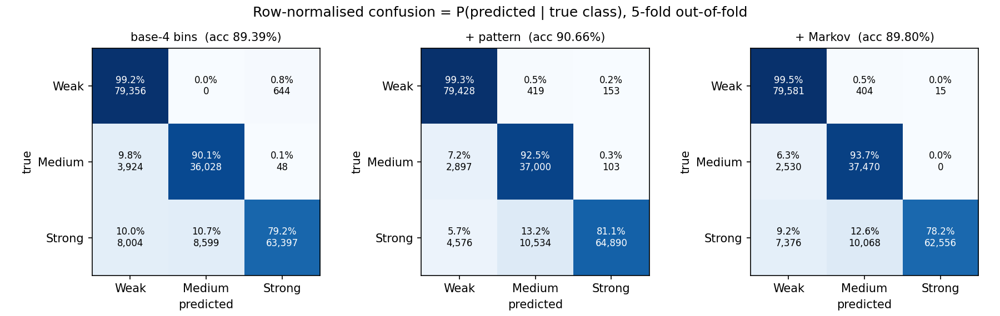
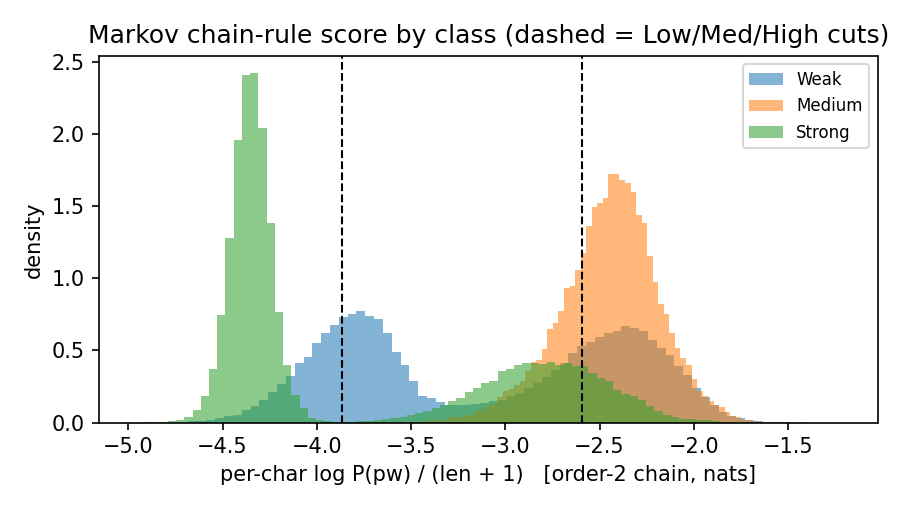
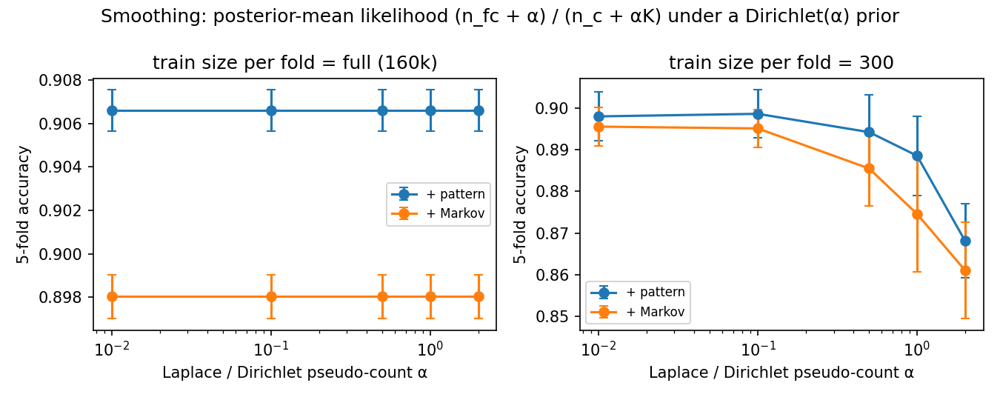
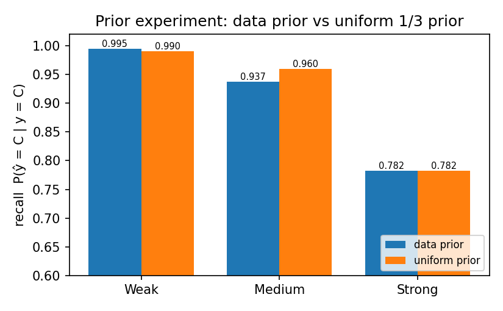
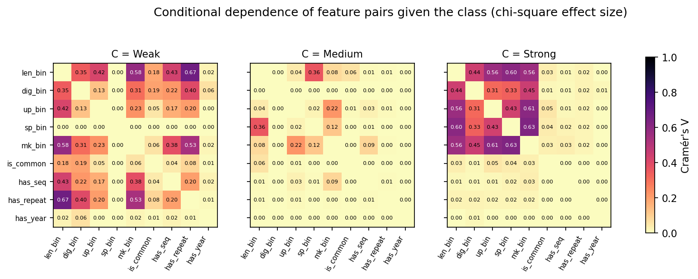
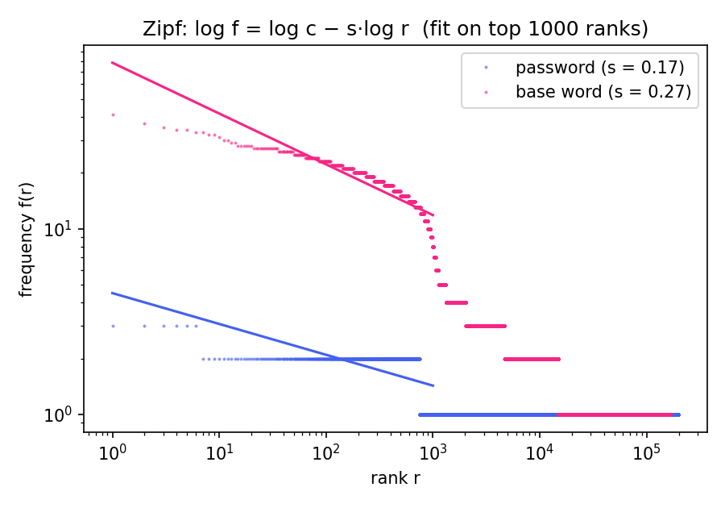

# Password Strength Estimation using Bayesian Intelligence

**Course:** BAMAT207 Probability and Statistics · **Track:** Bayesian Intelligence
**Reproduce:** `python -m src.evaluate` regenerates every number, table (`results/tables/`) and figure (`results/figures/`) quoted below.

---

## 1. Introduction

A password checker answers one question: *given this string, how likely is it to be weak, medium or strong?* That is a posterior probability, P(C | password). This project builds that posterior with Bayes' theorem and nothing more exotic:

1. A **naive Bayes** classifier over nine features: four binned composition counts (length, digits, uppercase, symbols), four binary attack patterns (common-password base, keyboard run, triple repeat, year), and one Markov-chain predictability bin.
2. A **character-level Markov chain** trained only on the training passwords. It scores how "natural" a string looks via the chain rule of probability.
3. A rigorous **evaluation**: 5-fold cross-validation, a majority baseline, binomial and bootstrap confidence intervals, McNemar's test, an ablation, a smoothing (Dirichlet-prior) sweep and a prior experiment.
4. **Statistical diagnostics** of the model's own assumptions: chi-square tests of conditional independence, three kinds of entropy, and Zipf's law.

The headline result: the pattern-augmented model reaches **90.66 % ± 0.10 %** 5-fold accuracy against a **40.00 %** majority baseline. Adding the Markov feature *lowers* accuracy to 89.80 %, and McNemar's test says that drop is real (p ≈ 3 × 10⁻¹⁸⁰). Sections 6 and 7 explain why. In short, the dataset's "very weak" passwords are random short strings, which an n-gram model reads as *unpredictable*, and the new feature double-counts information that the independence assumption cannot absorb. The chi-square tests confirm the violation directly.

---

## 2. Theory

### 2.1 Conditional probability, joint probability and Bayes' theorem

For events A and B with P(B) > 0, the **conditional probability** is P(A | B) = P(A ∩ B) / P(B). Rearranging gives the **joint probability** P(A ∩ B) = P(A | B) P(B), and applying it both ways gives **Bayes' theorem**:

$$P(C \mid x) = \frac{P(x \mid C)\,P(C)}{P(x)}, \qquad P(x) = \sum_{c} P(x \mid c)\,P(c).$$

The denominator is the **law of total probability**: the evidence P(x) is the sum of the joint probabilities over all classes. P(C) is the **prior** (belief before seeing the password), P(x | C) the **likelihood**, and P(C | x) the **posterior**.

*With our data:* the empirical prior is P(Weak) = 80 000 / 200 000 = **0.40**, P(Medium) = **0.20**, P(Strong) = **0.40** (`results/tables/prior.csv`).

### 2.2 The naive Bayes factorisation

A password is described by a feature vector x = (f₁, …, f₉). Estimating the joint P(f₁, …, f₉ | C) directly would need a table with 6·4·4·4·3·2⁴ = 18 432 cells per class. Naive Bayes assumes the features are **conditionally independent given the class**:

$$P(f_1,\dots,f_9 \mid C) = \prod_{j=1}^{9} P(f_j \mid C) \quad\Longrightarrow\quad P(C\mid x) \propto P(C)\prod_j P(f_j \mid C).$$

The joint over nine features then collapses to nine small conditional tables, at most 6 × 3 each. The price is that the assumption may be false. Section 6.6 tests it.

### 2.3 Laplace smoothing as a Dirichlet (Beta) prior

The maximum-likelihood estimate P̂(f = v | C) = n_{v,C} / n_C is zero for any value never seen with a class. A single zero then vetoes the whole product. Put a symmetric **Dirichlet(α, …, α)** prior on the K category probabilities of a feature. The Dirichlet is conjugate to the multinomial, so the posterior is Dirichlet(n₁+α, …, n_K+α), and its **posterior mean** is

$$\hat P(f=v\mid C) = \frac{n_{v,C} + \alpha}{n_C + \alpha K}.$$

For a binary feature (K = 2) this is the Beta(α, α) prior on a Bernoulli parameter θ. With α = 1 it is classic Laplace smoothing.

*With our data:* no Weak password in the sample contains a symbol, so n_{sp=1, Weak} = 0. The smoothed likelihood is P(sp_bin = 1 | Weak) = (0 + 1)/(80 000 + 4·1) = **1.2499 × 10⁻⁵**. That is small but not zero, exactly as stored in `likelihood_sp_bin.csv`.

### 2.4 Log space and log-sum-exp

Nine probabilities multiplied together underflow quickly; the Medium joint for `Summer2026!` is 2.1 × 10⁻¹⁹. We therefore add logarithms, s_C = ln P(C) + Σ_j ln P(f_j | C), and normalise with

$$\ln P(x) = \operatorname{logsumexp}_C(s_C) = m + \ln\sum_C e^{s_C - m}, \quad m = \max_C s_C,$$

which is the law of total probability evaluated stably. For explanation we also report each feature's **log-evidence** (the log-likelihood ratio) ln P(f | Strong) − ln P(f | Weak). Because the prior here is symmetric, P(Strong) = P(Weak), the posterior log-odds of Strong vs Weak is exactly the sum of these terms.

### 2.5 Markov chains and the chain rule

The **chain rule** writes any joint probability as a product of conditionals: P(c₁…c_n) = Π_i P(c_i | c₁…c_{i−1}). An **order-k Markov chain** truncates the history to the previous k characters:

$$P(\text{pw}) = \prod_{i=1}^{n+1} P(c_i \mid c_{i-k}\dots c_{i-1}),$$

with the string padded as `^^…pw$` so that the first and last transitions are modelled. Each transition is a Laplace-smoothed conditional probability (n(ctx·c) + 1)/(n(ctx) + V), where V is the alphabet size plus one. Long passwords naturally have tiny probabilities, so we use the **per-character score** ln P(pw)/(n + 1). Higher scores (closer to 0) mean more predictable text.

### 2.6 Inference tools

- **Wilson binomial CI.** Each test prediction is a Bernoulli trial (correct or not), so the number correct is Binomial(n, p). The Wilson interval inverts the normal test and stays inside [0, 1].
- **Bootstrap CI.** Resample the n out-of-fold correctness indicators with replacement 1 000 times and take the 2.5th and 97.5th percentiles.
- **McNemar's test.** For two classifiers on the same items, only the *discordant* pairs matter. Let b = items A gets right and B wrong, and c the reverse. Under H₀ (equal accuracy), b ~ Binomial(b + c, ½). The statistic χ² = (|b − c| − 1)²/(b + c) is ~χ²₁.
- **Chi-square test of independence.** For two features within one class, compare observed counts O to the counts E expected under independence, E = row·col/n, using χ² = Σ (O − E)²/E. The effect size is Cramér's V = √(χ²/(n(min(r, c) − 1))) ∈ [0, 1].
- **Entropy.** For a distribution p₁ ≥ p₂ ≥ …:
  - Shannon entropy H = −Σ p_i log₂ p_i is the average surprise.
  - Guessing entropy G = Σ i·p_i is the expected number of guesses by an optimal attacker.
  - Min-entropy H∞ = −log₂ p₁ is the worst case, the chance that the first guess succeeds.
- **Zipf's law.** Frequency is a power of rank, f(r) ∝ r^(−s), so log f is linear in log r with slope −s.

---

## 3. Data and exploratory analysis

**Source.** PWLDS (Infinitode, 2024, CC BY 4.0) has 15 million synthetic passwords in five files, one per level: 0 very weak, 1 weak, 2 average, 3 strong, 4 very strong. That is ≈3.0 M rows each. Level 4 was generated with Python's `secrets` module.

**Cleaning and labels.** Files are read as RFC-4180 CSV with `dtype=str` and `keep_default_na=False`. This matters because a password such as `null` or `NA` must not become a missing value. The parser unescapes doubled quotes. Any `###COMMA###` token is restored to `,`, and empty passwords are dropped (none occurred). The five levels are merged into three classes: **Weak = {0, 1}, Medium = {2}, Strong = {3, 4}**.

**Sample.** Reading 15 M rows on every run is wasteful, so we draw a seeded random sample of **40 000 rows per file**, giving 200 000 passwords cached in `data/sample.csv`. Only 755 rows (0.38 %) are exact duplicates of another row.

*Figure 1. Empirical class prior P(C): 40 % Weak, 20 % Medium, 40 % Strong. Merging levels makes the classes imbalanced, so the majority baseline is 40 %. Weak and Strong tie; the tie is broken towards Weak.*

**Length is almost a label.** Mean length by level is 4.44 (level 0, range 2–9), 11.06 (level 1, 4–15), 11.03 (level 2, 8–12), 11.10 (level 3, 10–14) and 24.01 (level 4, 16–32). The conditional distribution P(len_bin | C) shows it: P(len < 6 | Weak) = 0.479, P(16+ | Strong) = 0.500, and P(16+ | Weak) = 1.25 × 10⁻⁵ (a smoothed zero).

**Composition rules are visible.** Weak passwords never contain a symbol: P(sp_bin = 0 | Weak) = 0.99996. Medium passwords almost always contain exactly one: P(sp_bin = 1 | Medium) = 0.901. Strong passwords mostly contain four or more: P(sp_bin = 4+ | Strong) = 0.551. Medium passwords contain no digits at all, which is why some chi-square tests in §6.6 are undefined for Medium.

**Patterns are rare.**

| feature | P(f = 1 \| Weak) | P(f = 1 \| Medium) | P(f = 1 \| Strong) |
|---|---|---|---|
| is_common | 0.01306 | 0.00027 | 0.00055 |
| has_seq | 0.161 | 0.010 | 0.017 |
| has_repeat | 0.273 | 0.0003 | 0.0016 |
| has_year | 0.00044 | 0.00002 | 0.00002 |

Repeats and keyboard runs come from level-1 strings such as `actinism6kkkk` and `asdfadinole5`.

---

## 4. Methodology

**Features (`src/features.py`, the single source of truth).** `extract(pw)` returns:

- **Binned features** (multinomial NB). The edges live in one `BINS` dict. Every column is reindexed to its full label set, so bins unseen in a fold still get a smoothed count.
  - len_bin: <6 / 6–7 / 8–9 / 10–11 / 12–15 / 16+
  - dig_bin: 0 / 1–2 / 3–4 / 5+
  - up_bin: 0 / 1 / 2–3 / 4+
  - sp_bin: 0 / 1 / 2–3 / 4+
- **Pattern features** (Bernoulli NB):
  - `is_common`: the password, its de-leeted form, or its *base word* (digit/symbol padding stripped, then 0→o, 1→i, 3→e, 4→a, 5→s, 7→t, @→a, $→s, !→i) is in SecLists' 10k most common list.
  - `has_seq`: a run of length ≥ 3 from the alphabet, the digits or a keyboard row, forwards or backwards.
  - `has_repeat`: the regex `(.)\1\1`.
  - `has_year`: the regex `(19|20)\d{2}`.
- **Continuous features**: length and unique_ratio = |set(p)|/|p|. These are shown in the demo but not used by the classifier.
- **Markov bin** (mk_bin): the order-2 per-character score cut at the training tertiles into Low (< −3.868), Med, and High (≥ −2.595 nats/char).

**Model (`src/model.py`).** `NaiveBayes.fit` computes the prior (`prior_mode="data"` or `"uniform"` = ⅓ each) and one Laplace-smoothed table per feature, over all levels × all classes. `predict_proba` works in log space with log-sum-exp. `explain_row` returns the step table and the per-feature log-evidence. `PasswordModel` wraps the feature pipeline. When the Markov feature is used, it trains the chain and fits the tertile edges **on the training passwords only**.

**Protocol (`src/evaluate.py`).**

- Stratified 5-fold CV with seed 42. For each fold, the Markov chain is retrained on that fold's training passwords, so no test password ever contributes an n-gram count.
- Out-of-fold (OOF) predictions over all 200 000 rows feed the confusion matrix, the CIs and McNemar's test.
- **Ablation:** base-4 → + 4 patterns → + mk_bin.
- **Experiments:**
  - α ∈ {0.01, 0.1, 0.5, 1, 2}, on full folds and on 300-password training subsets.
  - Data vs uniform prior.
  - Markov order 1, 2, 3.

---

## 5. Worked example

All numbers below come from the final model trained on the full 200 k sample (`results/tables/worked_examples.md`).

### 5.1 `Summer2026!`

The extracted features are length 11 → **10-11**, 4 digits → **3-4**, 1 upper → **1**, 1 symbol → **1**, Markov **Low**, and pattern flags **is_common = 1** (base word "summer"), has_seq = 0, has_repeat = 0, **has_year = 1** (2026).

| step | Weak | Medium | Strong |
|---|---|---|---|
| prior P(C) | 0.4 | 0.2 | 0.4 |
| P(len=10-11 \| C) | 0.16335 | 0.56182 | 0.33108 |
| P(dig=3-4 \| C) | 0.04646 | 2.50e-05 | 0.19453 |
| P(up=1 \| C) | 0.23199 | 0.48460 | 0.16720 |
| P(sp=1 \| C) | **1.25e-05** | 0.90064 | 0.16562 |
| P(mk=Low \| C) | 0.20011 | 2.50e-05 | 0.63323 |
| P(is_common=1 \| C) | 0.01306 | 2.75e-04 | 5.50e-04 |
| P(has_seq=0 \| C) | 0.83907 | 0.98985 | 0.98331 |
| P(has_repeat=0 \| C) | 0.72668 | 0.99970 | 0.99841 |
| P(has_year=1 \| C) | 4.37e-04 | 2.50e-05 | 2.50e-05 |
| **joint** P(C)·∏P(f\|C) | 6.138e-15 | 2.085e-19 | 6.098e-12 |
| **evidence** P(x) = Σ joint | 6.104e-12 | 6.104e-12 | 6.104e-12 |
| **posterior** P(C \| x) | 0.00101 | 3.4e-08 | **0.99899** |

By hand:

- Joint for Strong: 0.4 × 0.33108 × 0.19453 × 0.16720 × 0.16562 × 0.63323 × 0.00055 × 0.98331 × 0.99841 × 0.000025 = 6.10 × 10⁻¹².
- Evidence: 6.138 × 10⁻¹⁵ + 2.085 × 10⁻¹⁹ + 6.098 × 10⁻¹² = 6.104 × 10⁻¹² (law of total probability).
- Posterior: 6.098/6.104 = 0.99899.

**Log-evidence** ln P(f|Strong) − ln P(f|Weak):

| | len | dig | up | sp | mk | common | seq | repeat | year | **sum** |
|---|---|---|---|---|---|---|---|---|---|---|
| nats | +0.71 | +1.43 | −0.33 | **+9.49** | +1.15 | **−3.17** | +0.16 | +0.32 | **−2.86** | **+6.90** |

The sum, 6.90, equals ln(6.098 × 10⁻¹² / 6.138 × 10⁻¹⁵) = ln 993.5, the posterior log-odds of Strong over Weak. Both attack patterns vote Weak, by −3.17 and −2.86 nats. A single symbol votes Strong by +9.49 nats, because P(sp = 1 | Weak) is a smoothed zero. **The model calls `Summer2026!` Strong.** Any human attacker would call it weak. Section 7 discusses this.

### 5.2 A random string: `>odJFCrn](l.2edl`

This string was drawn from `random.Random(42)` over letters, digits and punctuation. Its features are 16+ length, 1-2 digits, 2-3 upper, 4+ symbols, Markov Low, and no patterns. The likelihoods for Strong are 0.49998, 0.41779, 0.20784, 0.55122, 0.63323, then roughly 0.98–0.9999 for the four absent patterns. For Weak, both len = 16+ and sp = 4+ are smoothed zeros of 1.25 × 10⁻⁵. The joints are 8.90 × 10⁻¹⁴ (Weak), 4.61 × 10⁻²¹ (Medium) and 5.95 × 10⁻³ (Strong), so the evidence is P(x) = 5.95 × 10⁻³. The posterior is P(Strong | x) = 1 − 1.5 × 10⁻¹¹. The log-evidence is dominated by length (+10.60) and symbols (+10.69), and sums to +24.93 nats.

---

## 6. Results

### 6.1 Accuracy, baseline and confidence intervals

| model | 5-fold acc (mean ± sd) | Δ vs base | Wilson 95 % CI | bootstrap 95 % CI | macro F1 |
|---|---|---|---|---|---|
| majority baseline (always Weak) | 0.4000 | — | — | — | — |
| base-4 bins | 0.8939 ± 0.0043 | — | [0.8925, 0.8952] | [0.8926, 0.8952] | 0.8860 |
| **+ pattern** | **0.9066 ± 0.0010** | **+0.0127** | [0.9053, 0.9079] | [0.9054, 0.9078] | **0.8958** |
| + Markov | 0.8980 ± 0.0010 | +0.0041 | [0.8967, 0.8994] | [0.8968, 0.8993] | 0.8896 |

*Table 1 (`results/tables/ablation.csv`).* With n = 200 000, the binomial standard error is about √(0.9·0.1/200 000) ≈ 0.00067, so the CIs are ±0.0013 wide. The Wilson and bootstrap intervals agree to the fourth decimal. Every model beats the baseline by roughly 50 points.

### 6.2 Per-class performance

| class | base P / R / F1 | + pattern P / R / F1 | + Markov P / R / F1 |
|---|---|---|---|
| Weak | 0.869 / 0.992 / 0.927 | 0.914 / 0.993 / 0.952 | 0.889 / 0.995 / 0.939 |
| Medium | 0.807 / 0.901 / 0.852 | 0.772 / 0.925 / 0.841 | 0.782 / 0.937 / 0.852 |
| Strong | 0.989 / 0.793 / 0.880 | 0.996 / 0.811 / 0.894 | **1.000** / 0.782 / 0.878 |

*Figure 2. Row-normalised confusion matrices are the conditional probabilities P(predicted | true class), from out-of-fold predictions. The dominant error in every model is Strong predicted as Weak or Medium. These are level-3 passwords such as `aborted1Dp`, which share length 10–11 and word-like structure with level 1 and level 2.*

### 6.3 Ablation and McNemar's test

| A vs B | b (A right, B wrong) | c (A wrong, B right) | χ²₁ | p |
|---|---|---|---|---|
| base vs + pattern | 569 | 3 106 | 1 750.0 | < 10⁻³⁰⁰ |
| base vs + Markov | 1 306 | 2 132 | 198.0 | 5.8 × 10⁻⁴⁵ |
| + pattern vs + Markov | 2 640 | 929 | 819.3 | 3.4 × 10⁻¹⁸⁰ |

*Table 2 (`results/tables/mcnemar.csv`).* All three differences are significant. Adding patterns fixes 3 106 passwords and breaks 569. Adding mk_bin on top fixes 929 and breaks 2 640.

**Example flips (`results/tables/flips.csv`).**

- Fixed by Markov: `accersitionD` and `Iabsentation` (true Medium; the pattern model said Weak), and `adhereyyYy` (true Weak; the pattern model said Medium). In each case the High-predictability bin is what tipped it.
- Broken by Markov: `accruerBBO`, `aceturicAW` and `AcmaeahyVx` (true Strong, now predicted Weak). These are dictionary words with 2–3 capitals and no symbol, which the chain reads as High predictability.

### 6.4 Markov order and sparsity

| order k | contexts seen | unseen-context rate (Weak / Medium / Strong) | mean score (W / M / S) | CV acc |
|---|---|---|---|---|
| 1 | 94 | 0 / 0 / 0 | −3.46 / −2.96 / −4.14 | 0.8985 |
| 2 | 8 836 | 0 / 0 / 0 | −3.17 / −2.48 / −4.03 | 0.8980 |
| 3 | 546 148 | 0.5 % / 0.3 % / **24.1 %** | −3.26 / −2.22 / −3.92 | 0.8996 |

*Figure 3. The distribution of the per-character chain-rule score ln P(pw)/(n + 1) by class, with the Low/Med/High tertile cuts. This is the Markov transition model's view of each class.*

The number of possible contexts grows as 94^k: the chain saw 94, 94² = 8 836, and 546 k of the 94³ ≈ 831 k. At order 3, almost a quarter of the transitions in Strong test passwords have a context never seen in training, so smoothing returns the uniform 1/V. **Sparsity hurts exactly where it matters**: for random strings, a high-order chain says "unknown" rather than "unpredictable". Medium (dictionary words) gets *more* predictable with k (−2.96 → −2.22), as expected. The differences in accuracy between orders, 0.8980–0.8996, are smaller than the gain from patterns.

### 6.5 Smoothing (Dirichlet prior) experiment

*Figure 4. Accuracy vs the Dirichlet/Laplace pseudo-count α. Left: with 160 k training passwords per fold, α ∈ [0.01, 2] does not change a single prediction; the prior is swamped by the data. Right: with only 300 training passwords per fold, the + pattern model falls from 0.8986 (α = 0.1) to 0.8681 (α = 2).*

With n_C ≈ 64 000 per class, adding α ≤ 2 to counts barely moves any estimate. With n_C ≈ 120, a large α drags the near-zero likelihoods, the ones that carry the signal (e.g. sp_bin for Weak), towards uniform. That costs 3 accuracy points. Small α (0.01–0.1) is best here because the dataset's rules make many true probabilities essentially zero.

### 6.6 Prior experiment

| prior | Weak recall | Medium recall | Strong recall | accuracy | macro F1 |
|---|---|---|---|---|---|
| data (0.4 / 0.2 / 0.4) | 0.9948 | 0.9368 | 0.7820 | 0.8980 | 0.8896 |
| uniform (⅓ each) | 0.9904 | **0.9596** | 0.7820 | 0.9008 | 0.8895 |

*Figure 5. Per-class recall P(ŷ = C | y = C) under the data prior vs the uniform prior.*

Raising P(Medium) from 0.2 to ⅓ doubles the prior odds of Medium against both other classes (0.2/0.4 → ⅓/⅓). This moves borderline Weak-vs-Medium cases to Medium: Medium recall +2.3 points, Weak recall −0.4. Strong recall is identical. P(Strong)/P(Weak) is unchanged, so Strong can only lose cases to Medium, and none was close enough to that boundary to flip. The prior only matters where the likelihoods are close.

### 6.7 Chi-square test of the independence assumption

*Figure 6. Cramér's V for every feature pair within each class. This measures dependence in the joint distribution P(f₁, f₂ | C), which naive Bayes assumes factorises into P(f₁ | C) P(f₂ | C).*

We ran 36 pairs × 3 classes = 108 tests at a Bonferroni level of 0.05/108 = 4.63 × 10⁻⁴. **55 of 108 pairs reject independence**: 25/36 in Weak, 21/36 in Strong and 9/36 in Medium. Some highlights:

- len_bin × dig_bin: χ² = 28 749 (dof 12, V = 0.35) in Weak and χ² = 31 236 (dof 6, V = 0.44) in Strong.
- The strongest pair is len_bin × has_repeat in Weak (V = 0.67).
- The new feature is entangled with composition in Strong: sp_bin × mk_bin (V = 0.63), up_bin × mk_bin (V = 0.61), len_bin × mk_bin (V = 0.56).

Medium's median V is only 0.002. Its passwords follow one template, so given the class the features really are close to independent. Caveat: 23 of the 108 tests have > 20 % of cells with expected count < 5, so their p-values are approximate.

### 6.8 Entropy

| unit | class | N | distinct | Shannon H | log₂ G | min-entropy H∞ | log₂(distinct) |
|---|---|---|---|---|---|---|---|
| password | All | 200 000 | 199 245 | 17.602 | 16.599 | 16.025 | 17.604 |
| password | Weak | 80 000 | 79 441 | 16.274 | 15.268 | 14.703 | 16.278 |
| password | Medium | 40 000 | 39 853 | 15.280 | 14.277 | 13.703 | 15.282 |
| password | Strong | 80 000 | 79 984 | 16.287 | 15.287 | 15.288 | 16.287 |
| base word | All | 199 888 | 165 535 | 17.061 | 16.078 | **12.251** | 17.337 |
| base word | Weak | 79 889 | 63 422 | 15.520 | 14.630 | **11.241** | 15.953 |
| base word | Medium | 40 000 | 26 262 | 14.514 | 13.281 | 12.288 | 14.681 |
| base word | Strong | 79 999 | 78 171 | 16.225 | 15.221 | 12.480 | 16.254 |

*Table 3 (`results/tables/entropy.csv`). All values are in bits. G is the expected number of guesses an optimal attacker needs. The 112 all-digit/symbol passwords have no base word and are excluded from that unit.*

Min-entropy and Shannon entropy always satisfy H∞ ≤ H ≤ log₂(distinct). Guessing entropy is not ordered with them in general: for a uniform distribution, log₂ G ≈ H − 1 < H∞ = H, which is what the Strong row shows. The three measure different things:

- **Shannon** entropy over whole passwords is 17.602 bits, within 0.002 bits of the ceiling log₂(199 245) = 17.604. The sample is almost uniform because nearly every password is unique. An empirical entropy can never exceed log₂ N, so this is a property of the *sample size*, not a population estimate.
- **Guessing** entropy: G = 99 248 ≈ (N + 1)/2, exactly what a uniform distribution gives.
- **Min-entropy** is the one that separates the units. Over whole passwords, H∞ = 16.03 bits: the most frequent password (`qodn`) has p = 3/200 000. Over *base words*, H∞ falls to **12.25 bits**, because the top base word `abdicant` appears 41 times (p = 2.05 × 10⁻⁴). In the Weak class it falls to **11.24 bits** (p = 4.1 × 10⁻⁴).

The gap H − H∞ is 4.8 bits for base words against 1.6 for passwords. That gap is the skew an attacker exploits: guess dictionary words first, then the padding. This is exactly why `is_common` strips padding before the lookup.

### 6.9 Zipf's law

*Figure 7. Rank–frequency plot of the empirical password distribution on log–log axes, with least-squares fits on the top 1 000 ranks.*

| unit | distinct | max frequency | items with f ≥ 2 | fitted s |
|---|---|---|---|---|
| password | 199 245 | 3 | 749 | 0.166 |
| base word | 165 535 | 41 | 14 866 | 0.273 |

Real leaked password lists are reported to follow Zipf's law (Wang et al., 2017), with a heavy head of `123456`-style passwords. PWLDS does not. The most frequent password appears only 3 times in 200 000, and the slope is nearly flat. This confirms the README's warning that the data are synthetic and rule-generated, not drawn from human choice.

---

## 7. Discussion

**Why patterns help and Markov hurts.** The four pattern flags carry information that the counts do not. A triple repeat (`kkkk`) or a keyboard run (`asdf`) is a level-1 signature, which is why Weak precision rises from 0.869 to 0.914. The Markov bin, by contrast, mostly re-encodes length and composition. Long random strings and short random strings both score Low; dictionary words with a capital score High. Naive Bayes multiplies each likelihood as if it were fresh evidence, so a correlated feature is **double-counted**. The +0.63 Cramér's V between sp_bin and mk_bin in Strong is that double-counting made visible. The result is overconfidence that flips 2 640 correct Strong predictions. The Markov feature *does* help the classes where it is genuinely new information: Medium recall 0.925 → 0.937, and Weak recall 0.993 → 0.995.

**The Summer2026! paradox.** The model is right *about the dataset* and wrong *about the world*. In PWLDS, P(symbol | Weak) is essentially 0, so one `!` is worth +9.5 nats of evidence. That outweighs the −6.0 nats from "common base word" plus "contains a year". This is a lesson about priors and likelihoods learned from synthetic data. A posterior is only as good as the generative story behind the training labels. The demo surfaces this explicitly: it shows the pattern flags in red, and it adds a note whenever a flagged password is still called Strong.

**Probability concepts in action.**

| concept | where it appears |
|---|---|
| conditional probability | likelihood tables P(f \| C) (§3, `likelihood_*.csv`), Markov transitions P(c_i \| ctx) (§2.5) |
| joint probability | NB product (§5 "joint" row), crosstab counts in chi-square (§6.7), Markov chain rule |
| Bayes' theorem | `predict_proba`; evidence row = law of total probability (§5) |
| prior & posterior | empirical vs uniform prior (§6.6); posterior row and demo bars |
| Dirichlet / Beta prior | Laplace smoothing (§2.3), α sweep (§6.5) |
| Markov chains | `src/markov.py`, order study (§6.4) |
| chi-square, entropy, Zipf | §6.7–6.9 (`src/stats_tests.py`) |
| binomial CI, bootstrap, McNemar | §6.1, §6.3 |

---

## 8. Limitations and conclusion

**Limitations.**

1. **The naive Bayes assumption is violated.** 55 of 108 within-class feature pairs fail the chi-square test at the Bonferroni level, with Cramér's V up to 0.67. The posteriors are therefore over-confident: 0.99899 for `Summer2026!` is not a calibrated probability. The *ranking* of classes is what the model gets right 90 % of the time.
2. **The data are synthetic.**
   - Zipf slope 0.17 and a maximum frequency of 3 show the data have no human-choice head.
   - The class rules (e.g. "Weak never has symbols") are artefacts the model learns perfectly and that do not hold in the real world.
   - Accuracy on real leaks would be different and is untested here.
3. **Sampling.** We use a 200 k random sample (1.3 % of PWLDS). With a standard error of 0.07 %, using more data would not change any conclusion.
4. **Label merging.** Merging 5 levels into 3 is a modelling choice. Level 3 (word-based "strong") is the main source of error.
5. **Single global chain.** One chain for all classes measures generic predictability. Per-class chains (a generative classifier in their own right) would likely be more discriminative. The continuous features (length, unique_ratio) were not used in a Gaussian NB variant.

**Conclusion.** A transparent naive Bayes model reaches 90.66 % [90.53, 90.79] accuracy on three-class password strength, 50 points above the majority baseline. Every prediction decomposes into a prior, nine readable likelihoods, and a log-sum-exp normalisation. Attack-pattern features add 1.3 points (McNemar p < 10⁻³⁰⁰). A Markov predictability feature, despite being a richer probabilistic model, lowers accuracy by 0.9 points, because it violates the independence assumption the classifier is built on. The chi-square tests predicted this, and the per-class recall and the flips confirm it. The Dirichlet-prior view of smoothing explains why α is irrelevant at 160 k training examples but costs 3 points at 300.

**References.**

- Infinitode Pty Ltd (2024). *Password Weakness and Level Dataset (PWLDS).* github.com/Infinitode/PWLDS, CC BY 4.0.
- Miessler, D. et al. *SecLists*, `Passwords/Common-Credentials/10k-most-common.txt`.
- Wang, D., Cheng, H., Wang, P., Huang, X., Jian, G. (2017). Zipf's Law in Passwords. *IEEE Transactions on Information Forensics and Security*.
